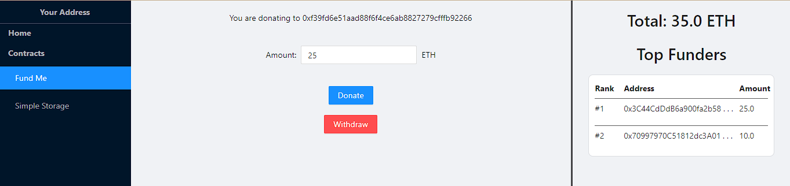

# Hardhat React Dapp

[](LICENSE)

This repository contains a beginner project I built for learning basic web and smart contract development.

## Quick start

Clone this repository and install its dependencies:

```sh
git clone https://github.com/iamnmt/hardhat-react-dapp.git
cd hardhat-react-dapp
```

Run Hardhat's testing network:

```sh
npx hardhat node
```

On a new terminal, compile all current contracts:

```sh
npx hardhat compile
```

Move contracts' artifact into frontend folder by using hardhat script (I think there is a better way for importing those artifacts to react-app but I gonna do this for now):

```sh
npx hardhat run scripts/migrate.js
```

Install dependencies and run the front-end:

```sh
cd frontend
npm install
npm start
```

An Dapp will be started on [http://localhost:3000/](http://localhost:3000/). You will
need to have [Metamask](https://metamask.io) installed and listening to `localhost 8545`.

## Testing

There is prepared tests in the `test/` folder:

```sh
npx hardhat test
```

## Deploying to Rinkeby testnet

Set up environment variables by creating `.env` file in the root folder:

```sh
INFURA_API="<YOUR_INFURA_API>"
ETHERSCAN_API="<YOUR_ETHERSCAN_API>"
PRIVATE_KEY="<YOUR_PRIVATE_KEY>"
```

Run hardhat script to deploy a new contract:

```sh
npx hardhat run --network rinkeby scripts/deploy-<CONTRACT_NAME>.js
```

Verify a deployed contract on Etherscan:

```sh
npx hardhat verify --network rinkeby <DEPLOYED_CONTRACT_ADDRESS>
```

## Contracts completed

Before interacting with any contract you need to connect to your address first by going to the "Connect" tab.

### Fund Me



- The address deployed the contract is the owner.
- Other addresses can fund the contract.
- Only the owner can withdraw ETH.
- Total fund and top funders on the right change when the contract gets updated.

## Things can be imporved on

- [ ] Styling for the front-end.
- [ ] State management for React components: I think currently there is something wrong with the way components nested which can cause some bad performance.
- [ ] Deploying and interacting with contracts across multiple networks in the front-end (currently you can only deploy contracts to `localhost 8545`)
